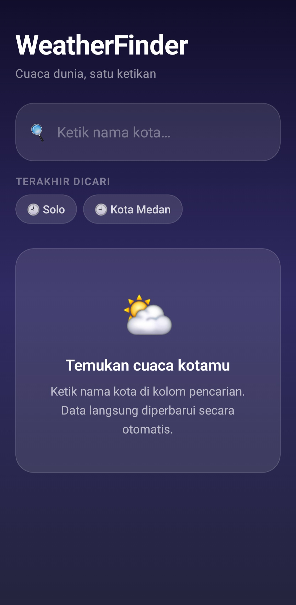
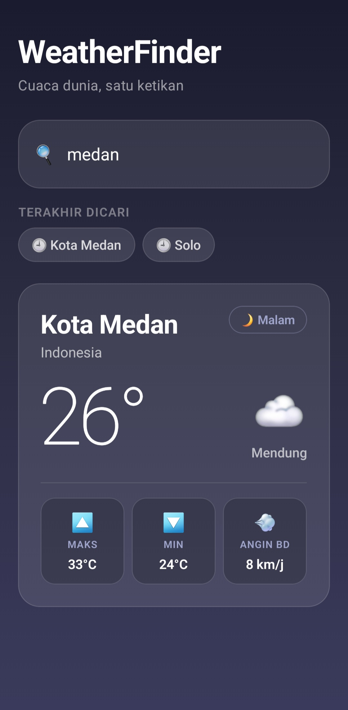
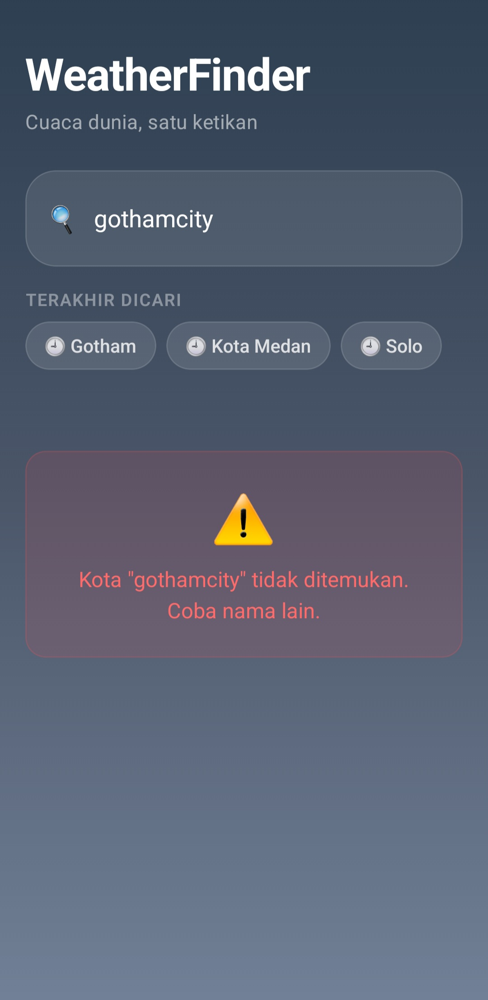

# ⛅ WeatherFinder

Aplikasi cuaca minimalis berbasis React Native (Expo) yang menggunakan Open-Meteo API — gratis, tanpa API key.

## ✨ Fitur

### 🟢 Level 1 — Core
- [x] TextInput controlled (value + onChangeText)
- [x] Debounce 500ms (1 permintaan per kota, bukan per huruf)
- [x] `useEffect` dengan dependency array `[query]`
- [x] Fetch 2 langkah: **Geocoding → Forecast**
- [x] 4 kondisi UI: Kosong · Loading · Error · Sukses
- [x] `AbortController` di cleanup function (anti memory leak)
- [x] Mapping 20+ kode cuaca WMO → label + emoji
- [x] Tampil: nama kota, negara, suhu (°C), kondisi cuaca

### 🟡 Level 2 — Pengembangan
- [x] **🕘 Riwayat Pencarian** — 5 kota terakhir tampil sebagai chip horizontal yang bisa di-tap
- [x] **🎨 Background Dinamis** — Gradien berubah sesuai kondisi cuaca (cerah, hujan, badai, dll) + waktu (siang/malam)
- [x] **🧭 Arah & Kecepatan Angin** — Bonus: ditampilkan di kartu cuaca

## 📸 Screenshot

| Kosong | Loading | Sukses | Error |
|--------|---------|--------|-------|
|  |  |  |  |

## 🚀 Cara Menjalankan

```bash
# 1. Clone repo
git clone https://github.com/<username>/weatherfinder.git
cd weatherfinder

# 2. Install dependencies
npm install

# 3. Jalankan
npx expo start

# 4. Scan QR di aplikasi Expo Go (Android/iOS)
```

## 🛠 Tech Stack

| Teknologi | Keterangan |
|-----------|-----------|
| React Native + Expo | Framework mobile |
| Open-Meteo API | Data cuaca (gratis, tanpa key) |
| expo-linear-gradient | Background gradien dinamis |
| React Hooks (useEffect, useState, useRef) | State & side effects |

## 🔗 Links

- **Expo Snack**: *(tempel link snack.expo.dev di sini)*
- **GitHub**: *(link repo)*